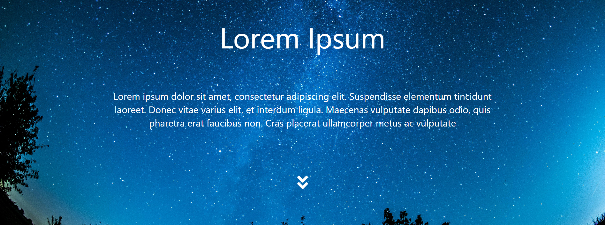

# 🚀 Landing Page Template - React based 🚀

This is a simple React-based landing page template that anyone can use as a starting point for your project. It includes basic styling and routing setup.

## Table of Contents

- [🚀 Landing Page Template - React based 🚀](#-landing-page-template---react-based-)
  - [Table of Contents](#table-of-contents)
    - [Key Features](#key-features)
    - [Screenshots](#screenshots)
    - [Links](#links)
    - [Built With](#built-with)
  - [Author](#author)

### Key Features

- Responsive design
- Navigation bar with links
- Routing setup using React Router
- Social media links
- Easy to customize
- Ends with an useful footer section

### Screenshots

### Links

- Solution URL: [GitHub Repository](https://github.com/chayansurana3/Landing-Page-Template.git)
- Live Site URL: [Employee Analytics - Live Site](https://org-analytics.netlify.app)

### Built With

- React.js
- HTML5 markup
- CSS
- NPM

## Author

- GitHub - [@chayansurana3](https://github.com/chayansurana3)
- Twitter - [@chayan_surana_](https://twitter.com/chayan_surana_)
